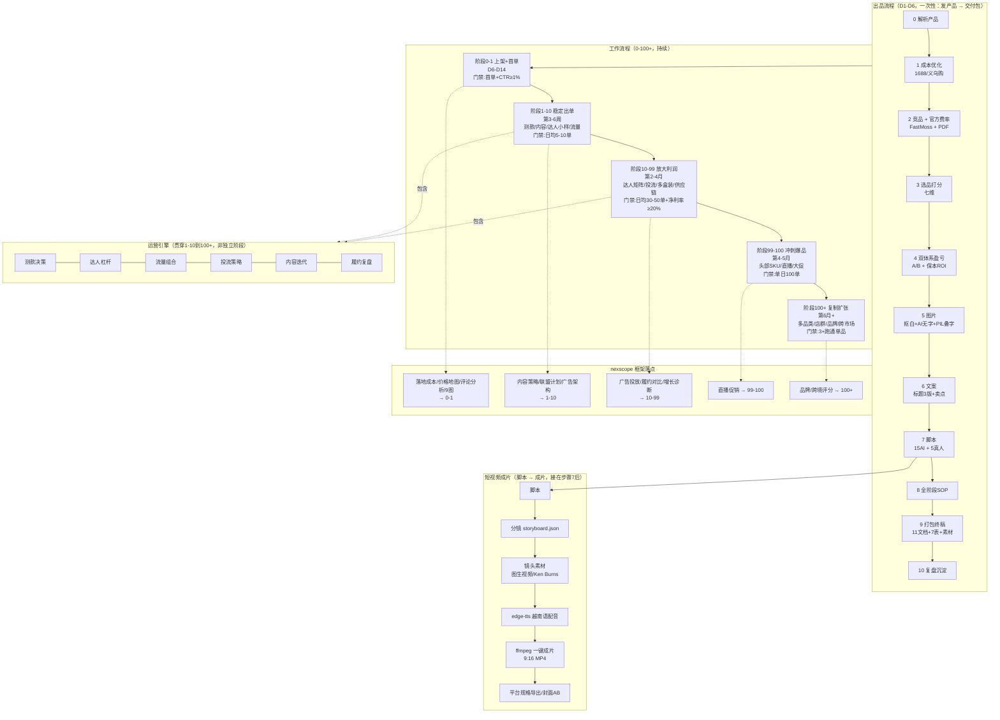

# 0-100+ 总图（出品流程 + 工作流程 + 视频成片，统一时间线）

## 时间线一图

| D1-D6 | D6-D14 | 第3-6周 | 第2-4月 | 第4-5月 | 第6月+ |
|---|---|---|---|---|---|
| 出品流程(11步) | 阶段0-1(上架+首单) | 阶段1-10(稳定出单) | 阶段10-99(放大) | 阶段99-100(冲刺) | 阶段100+(复制) |

## 置信度图例

- **官方**（可查）· **实测**（FastMoss/OCR/公开页）· **假设**（蒸馏估计，待回填）· **设定**（经营决策，可改）
- 完整标注见 `references/confidence-labels.md`。
